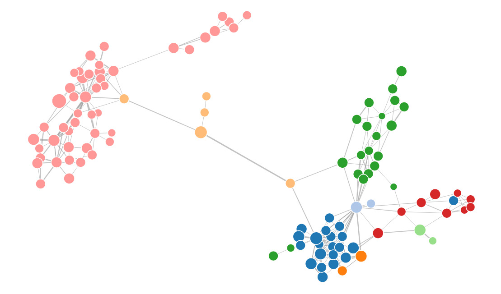

# DepView

Analyze calling dependencies in Java projects, and visualize them in a dependency graph.

Related article: [Depview: Java 程序调用依赖关系的分析与显示](http://nettee.github.io/posts/2018/Depview-View-invocation-relationships-in-Java-projects/)



## Quickstart

Build and package project:

```Shell
mvn package
```

Write a configuration file for the project that you want to analyze. Follow the examples in `conf-example/` directory.
Then run DepView:

```Shell
bin/depview <CONF_FILE>
```

Now the dependencies is in directory `output/<PROJECT_NAME>/graph.json`. You can view the dependency graph by running:

```Shell
bin/serve output/<PROJECT_NAME>
```

Open [localhost:8000](localhost:8000) to view the dependency graph.
